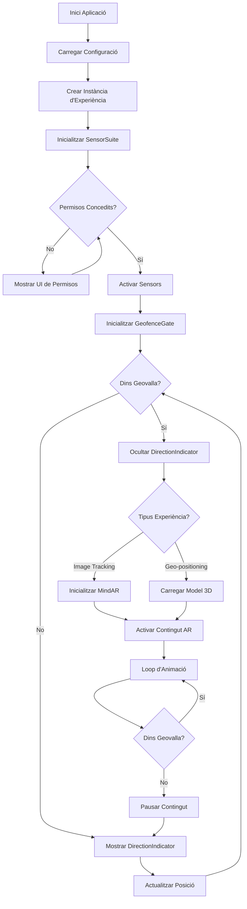

# NUBULUS WebXR - Guia d'Implementació del Projecte Unificat

## 📖 Índex

1. [Visió General](#-visió-general)
2. [Objectius del Projecte](#-objectius-del-projecte)
3. [Arquitectura Modular](#-arquitectura-modular)
4. [Flux d'Execució](#-flux-dexecució)
5. [Implementació dels Mòduls Core](#-implementació-dels-mòduls-core)
6. [Creació d'Experiències](#-creació-dexperiències)
7. [Configuració i Desplegament](#-configuració-i-desplegament)
8. [Guia de Desenvolupament](#-guia-de-desenvolupament)

---

## 🎯 Visió General

Aquest projecte unifica múltiples experiències WebXR (AR) sota una arquitectura modular comuna, on totes les experiències comparteixen:

- **Sistema de geolocalització** amb geovalles
- **Gestió unificada de sensors** (GPS, orientació, càmera)
- **Indicadors de navegació** per guiar l'usuari
- **Flux consistent** d'activació de contingut

### Tecnologies Clau

- **Three.js** - Renderització 3D i gestió d'escena
- **MindAR** - Image tracking per experiències basades en marcadors
- **Geolocation API** - Posicionament GPS
- **DeviceOrientation API** - Orientació del dispositiu
- **MediaDevices API** - Accés a la càmera

---

## 🎯 Objectius del Projecte

### 1. Unificació de Flux

Totes les experiències segueixen el mateix flux:

```
1. Sol·licitar permisos (GPS + Orientació + Càmera)
      ↓
2. Activar sensors i iniciar tracking
      ↓
3. Verificar geovalla (usuari dins/fora)
      ↓
4. Mostrar indicadors de navegació (si fora)
      ↓
5. Activar contingut AR (si dins)
      ↓
6. Gestionar transicions (entrar/sortir geovalla)
```

### 2. Modularitat i Reutilització

- Separació clara de responsabilitats
- Components reutilitzables entre experiències
- Configuració centralitzada
- Fàcil extensió amb noves experiències

### 3. Experiències a Implementar

| Experiència    | Tipus           | Tecnologia Principal | Característiques               |
| -------------- | --------------- | -------------------- | ------------------------------ |
| **Peixos**     | Image Tracking  | MindAR + Three.js    | Vídeo en PlaneGeometry         |
| **Belloc**     | Image Tracking  | MindAR + Three.js    | Vídeo en ShapeGeometry + Audio |
| **Penelles**   | Image Tracking  | MindAR + Three.js    | Vídeo escalat gran             |
| **Objecte 3D** | Geo-positioning | Three.js             | Model GLTF posicionat per GPS  |

---

## 🏗️ Arquitectura Modular

### Estructura de Carpetes

```
project-root/
├── index.html                      # Selector d'experiències
├── README.md
├── package.json
│
├── src/
│   ├── core/                       # Classes base i coordinadores
│   │   ├── BaseExperience.js       # Classe abstracta per totes les experiències
│   │   ├── GeofenceGate.js         # Gestió de geovalles i events
│   │   ├── SensorSuite.js          # Coordinació de tots els sensors
│   │   └── SceneManager.js         # Configuració Three.js compartida
│   │
│   ├── modules/                    # Mòduls funcionals específics
│   │   ├── geolocation/
│   │   │   ├── LocationTracker.js     # Tracking GPS
│   │   │   ├── OrientationTracker.js  # Orientació del dispositiu
│   │   │   ├── GeofenceUtils.js       # Càlculs geomètrics
│   │   │   └── DirectionIndicator.js  # Fletxa de navegació
│   │   │
│   │   ├── mindar/
│   │   │   ├── MindARController.js    # Inicialització i gestió MindAR
│   │   │   ├── VideoAnchorFactory.js  # Vinculació vídeo-target
│   │   │   └── TargetRegistry.js      # Gestió de múltiples targets
│   │   │
│   │   ├── rendering/
│   │   │   ├── ModelLoader.js         # Càrrega de models GLTF
│   │   │   ├── VideoPlaneBuilder.js   # Creació de geometries per vídeo
│   │   │   ├── ShapeBuilder.js        # Geometries personalitzades
│   │   │   └── MaterialFactory.js     # Creació de materials
│   │   │
│   │   ├── media/
│   │   │   ├── VideoManager.js        # Control de reproducció de vídeo
│   │   │   ├── AudioManager.js        # Control d'àudio
│   │   │   └── CameraManager.js       # Gestió de càmera del dispositiu
│   │   │
│   │   └── ui/
│   │       ├── StatusPanel.js         # Panell d'informació
│   │       ├── PromptManager.js       # Missatges i alertes
│   │       └── PermissionsUI.js       # UI per sol·licitar permisos
│   │
│   ├── experiences/                 # Implementacions d'experiències
│   │   ├── PeixosExperience.js
│   │   ├── BellocExperience.js
│   │   ├── PenellesExperience.js
│   │   └── Object3DExperience.js
│   │
│   ├── config/                      # Configuracions
│   │   ├── experiences.config.js    # Definició de cada experiència
│   │   ├── geofences.config.js      # Coordenades de geovalles
│   │   └── sensors.config.js        # Paràmetres de sensors
│   │
│   └── utils/                       # Utilitats generals
│       ├── MathUtils.js             # Funcions matemàtiques
│       ├── PermissionsManager.js    # Gestió de permisos del navegador
│       ├── Logger.js                # Sistema de logging
│       └── EventEmitter.js          # Sistema d'events
│
├── assets/                          # Recursos estàtics
│   ├── models/                      # Models 3D (.glb, .gltf)
│   ├── targets/                     # Targets MindAR (.mind)
│   ├── videos/                      # Vídeos
│   └── audio/                       # Fitxers d'àudio
│
└── styles/                          # Estils CSS
    ├── main.css                     # Estils globals
    ├── components/                  # Estils per components
    └── experiences/                 # Estils específics per experiència
```

---

## 🔄 Flux d'Execució

### Diagrama de Flux



### Seqüència d'Events

```javascript
// 1. Inicialització
experience.init()
  → SensorSuite.init()
    → PermissionsManager.requestAll()
    → LocationTracker.start()
    → OrientationTracker.start()
    → CameraManager.start()

// 2. Binding de sensors a GeofenceGate
GeofenceGate.bindSensors(SensorSuite)
  → LocationTracker.onUpdate() → GeofenceGate.evaluate()
  → OrientationTracker.onUpdate() → DirectionIndicator.update()

// 3. Events de Geovalla
GeofenceGate.on('enter', () => {
  experience.onEnterGeofence()
    → DirectionIndicator.hide()
    → experience.startContent()
})

GeofenceGate.on('leave', () => {
  experience.onLeaveGeofence()
    → experience.pauseContent()
    → DirectionIndicator.show()
})

GeofenceGate.on('update', (data) => {
  StatusPanel.update(data)
  DirectionIndicator.update(data)
})
```

---

## 🧩 Implementació dels Mòduls Core

### 1. BaseExperience (Classe Abstracta)

```javascript
/**
 * Classe base per totes les experiències AR
 */
export class BaseExperience {
  constructor(config) {
    this.id = config.id;
    this.name = config.name;
    this.geofence = config.geofence;

    // Inicialitzar mòduls core
    this.sensorSuite = new SensorSuite();
    this.geofenceGate = new GeofenceGate(this.geofence);
    this.statusPanel = new StatusPanel();
    this.promptManager = new PromptManager();
    this.directionIndicator = new DirectionIndicator();

    this.isActive = false;
  }

  /**
   * Inicialització: demanar permisos i activar sensors
   */
  async init() {
    try {
      // Mostrar UI de permisos
      await this.promptManager.showPermissionsPrompt();

      // Inicialitzar sensors
      await this.sensorSuite.init();

      // Vincular sensors a geofenceGate
      this.geofenceGate.bindSensors(this.sensorSuite);

      // Configurar events de geovalla
      this.bindGeofenceEvents();

      // Inicialitzar UI
      this.setupUI();

      console.log(`✅ ${this.name} inicialitzada`);
    } catch (error) {
      this.handleError(error);
    }
  }

  /**
   * Configurar listeners d'events de geovalla
   */
  bindGeofenceEvents() {
    this.geofenceGate.on("enter", (data) => {
      this.onEnterGeofence(data);
    });

    this.geofenceGate.on("leave", (data) => {
      this.onLeaveGeofence(data);
    });

    this.geofenceGate.on("update", (data) => {
      this.onGeofenceUpdate(data);
    });
  }

  /**
   * Configurar UI inicial
   */
  setupUI() {
    this.statusPanel.render();
    this.directionIndicator.init();
  }

  /**
   * Quan l'usuari entra a la geovalla
   * (A sobreescriure per cada experiència)
   */
  async onEnterGeofence(data) {
    console.log("📍 Dins de la geovalla");
    this.directionIndicator.hide();
    this.promptManager.showMessage("Geovalla activa! Busca el marcador.");
    await this.startContent();
  }

  /**
   * Quan l'usuari surt de la geovalla
   * (A sobreescriure per cada experiència)
   */
  onLeaveGeofence(data) {
    console.log("⚠️ Fora de la geovalla");
    this.pauseContent();
    this.directionIndicator.show();
    this.promptManager.showMessage("Apropa't a la zona per continuar.");
  }

  /**
   * Actualitzacions contínues de geovalla
   */
  onGeofenceUpdate(data) {
    this.statusPanel.update({
      inside: data.inside,
      distance: data.distance,
      heading: data.heading,
    });

    if (!data.inside) {
      this.directionIndicator.update({
        bearing: data.bearing,
        distance: data.distance,
        deviceHeading: this.sensorSuite.orientation.alpha,
      });
    }
  }

  /**
   * Iniciar contingut específic de l'experiència
   * (A sobreescriure)
   */
  async startContent() {
    throw new Error("startContent() ha de ser implementat per la classe filla");
  }

  /**
   * Pausar contingut
   * (A sobreescriure)
   */
  pauseContent() {
    throw new Error("pauseContent() ha de ser implementat per la classe filla");
  }

  /**
   * Netejar recursos abans de sortir
   */
  destroy() {
    this.sensorSuite.destroy();
    this.geofenceGate.destroy();
    if (this.sceneManager) {
      this.sceneManager.destroy();
    }
  }

  /**
   * Gestió d'errors
   */
  handleError(error) {
    console.error(`❌ Error a ${this.name}:`, error);
    this.promptManager.showError(error.message);
  }
}
```

### 2. GeofenceGate (Gestor de Geovalles)

```javascript
import { EventEmitter } from "../utils/EventEmitter.js";
import { GeofenceUtils } from "../modules/geolocation/GeofenceUtils.js";

/**
 * Gestiona l'entrada/sortida de geovalles i emet events
 */
export class GeofenceGate extends EventEmitter {
  constructor(polygon) {
    super();
    this.polygon = polygon;
    this.isInside = false;
    this.currentLocation = null;
    this.currentOrientation = null;
  }

  /**
   * Vincular sensors per rebre actualitzacions
   */
  bindSensors(sensorSuite) {
    // Escoltar actualitzacions de posició
    sensorSuite.onLocation((location) => {
      this.currentLocation = location;
      this.evaluate();
    });

    // Escoltar actualitzacions d'orientació
    sensorSuite.onOrientation((orientation) => {
      this.currentOrientation = orientation;
      this.emitUpdate();
    });
  }

  /**
   * Avaluar si l'usuari està dins/fora de la geovalla
   */
  evaluate() {
    if (!this.currentLocation) return;

    const result = GeofenceUtils.checkGeofence(
      this.currentLocation,
      this.polygon
    );

    // Detectar transicions
    if (!this.isInside && result.inside) {
      this.isInside = true;
      this.emit("enter", result);
    } else if (this.isInside && !result.inside) {
      this.isInside = false;
      this.emit("leave", result);
    }

    // Emetre actualització sempre
    this.emit("update", {
      ...result,
      orientation: this.currentOrientation,
    });
  }

  /**
   * Emetre event d'actualització sense re-avaluar
   */
  emitUpdate() {
    if (this.currentLocation) {
      const result = GeofenceUtils.checkGeofence(
        this.currentLocation,
        this.polygon
      );
      this.emit("update", {
        ...result,
        orientation: this.currentOrientation,
      });
    }
  }

  /**
   * Netejar resources
   */
  destroy() {
    this.removeAllListeners();
  }
}
```

### 3. SensorSuite (Coordinador de Sensors)

```javascript
import { LocationTracker } from "../modules/geolocation/LocationTracker.js";
import { OrientationTracker } from "../modules/geolocation/OrientationTracker.js";
import { CameraManager } from "../modules/media/CameraManager.js";
import { PermissionsManager } from "../utils/PermissionsManager.js";

/**
 * Coordina tots els sensors del dispositiu
 */
export class SensorSuite {
  constructor() {
    this.locationTracker = new LocationTracker();
    this.orientationTracker = new OrientationTracker();
    this.cameraManager = null; // S'inicialitza sota demanda

    this.callbacks = {
      location: [],
      orientation: [],
      camera: [],
    };
  }

  /**
   * Inicialitzar tots els sensors
   */
  async init() {
    // Sol·licitar permisos
    const permissions = await PermissionsManager.requestAll([
      "geolocation",
      "deviceorientation",
      "camera",
    ]);

    if (!permissions.geolocation) {
      throw new Error("Permís de geolocalització denegat");
    }

    // Iniciar tracking de localització
    this.locationTracker.start({
      enableHighAccuracy: true,
      maximumAge: 1000,
      timeout: 5000,
    });

    // Iniciar tracking d'orientació
    if (permissions.deviceorientation) {
      await this.orientationTracker.init();
      this.orientationTracker.start();
    }

    // Configurar callbacks interns
    this.locationTracker.onUpdate((location) => {
      this.callbacks.location.forEach((cb) => cb(location));
    });

    this.orientationTracker.onUpdate((orientation) => {
      this.callbacks.orientation.forEach((cb) => cb(orientation));
    });

    console.log("✅ Sensors inicialitzats");
  }

  /**
   * Iniciar càmera (només quan es necessiti)
   */
  async startCamera(videoElement) {
    if (!this.cameraManager) {
      this.cameraManager = new CameraManager(videoElement);
    }
    await this.cameraManager.start();
    this.callbacks.camera.forEach((cb) => cb());
  }

  /**
   * Subscriure's a actualitzacions de posició
   */
  onLocation(callback) {
    this.callbacks.location.push(callback);
  }

  /**
   * Subscriure's a actualitzacions d'orientació
   */
  onOrientation(callback) {
    this.callbacks.orientation.push(callback);
  }

  /**
   * Subscriure's a events de càmera
   */
  onCamera(callback) {
    this.callbacks.camera.push(callback);
  }

  /**
   * Obtenir última posició coneguda
   */
  get location() {
    return this.locationTracker.getCurrentLocation();
  }

  /**
   * Obtenir última orientació coneguda
   */
  get orientation() {
    return this.orientationTracker.getCurrentOrientation();
  }

  /**
   * Aturar tots els sensors
   */
  destroy() {
    this.locationTracker.stop();
    this.orientationTracker.stop();
    if (this.cameraManager) {
      this.cameraManager.stop();
    }
  }
}
```

---

## 🎬 Creació d'Experiències

### Exemple: Object3DExperience

```javascript
import { BaseExperience } from "../core/BaseExperience.js";
import { SceneManager } from "../core/SceneManager.js";
import { ModelLoader } from "../modules/rendering/ModelLoader.js";

export class Object3DExperience extends BaseExperience {
  constructor(config) {
    super(config);

    this.targetLocation = config.targetLocation;
    this.modelPath = config.model.path;
    this.modelScale = config.model.scale;
    this.visibilityDistance = config.model.visibilityDistance;

    this.sceneManager = null;
    this.model = null;
  }

  /**
   * Iniciar contingut 3D quan s'entra a la geovalla
   */
  async startContent() {
    if (!this.sceneManager) {
      // Crear escena Three.js
      this.sceneManager = new SceneManager({
        alpha: true, // Fons transparent
        antialias: true,
      });

      this.sceneManager.init();

      // Carregar model 3D
      this.model = await ModelLoader.load(this.modelPath);
      this.model.scale.setScalar(this.modelScale);
      this.sceneManager.addToScene(this.model);

      // Iniciar loop d'animació
      this.startAnimationLoop();
    }

    this.isActive = true;
  }

  /**
   * Loop d'animació
   */
  startAnimationLoop() {
    const animate = () => {
      if (!this.isActive) return;

      requestAnimationFrame(animate);

      // Actualitzar posició del model segons GPS
      this.updateModelPosition();

      // Renderitzar
      this.sceneManager.render();
    };

    animate();
  }

  /**
   * Actualitzar posició del model segons la distància GPS
   */
  updateModelPosition() {
    if (!this.model || !this.sensorSuite.location) return;

    const meters = GeofenceUtils.latLonToMeters(
      this.sensorSuite.location.latitude,
      this.sensorSuite.location.longitude,
      this.targetLocation.lat,
      this.targetLocation.lon
    );

    const distance = Math.sqrt(meters.x ** 2 + meters.z ** 2);

    // Posicionar model
    this.model.position.set(0, 0, -distance);
    this.model.visible = distance <= this.visibilityDistance;
  }

  /**
   * Pausar contingut
   */
  pauseContent() {
    this.isActive = false;
    if (this.model) {
      this.model.visible = false;
    }
  }
}
```

### Exemple: PeixosExperience (MindAR)

```javascript
import { BaseExperience } from "../core/BaseExperience.js";
import { MindARController } from "../modules/mindar/MindARController.js";
import { VideoAnchorFactory } from "../modules/mindar/VideoAnchorFactory.js";

export class PeixosExperience extends BaseExperience {
  constructor(config) {
    super(config);

    this.targetPath = config.mindar.target;
    this.videoPath = config.mindar.video;
    this.scale = config.mindar.scale || 1;

    this.mindARController = null;
    this.videoAnchor = null;
  }

  async startContent() {
    if (!this.mindARController) {
      // Inicialitzar MindAR
      this.mindARController = new MindARController({
        containerSelector: "#ar-container",
        targetPath: this.targetPath,
      });

      await this.mindARController.init();

      // Crear ancoratge de vídeo
      this.videoAnchor = VideoAnchorFactory.createPlane({
        videoPath: this.videoPath,
        scale: this.scale,
        autoAdjust: true,
      });

      // Afegir a l'ancoratge de MindAR
      const anchor = this.mindARController.addAnchor(0);
      anchor.group.add(this.videoAnchor.mesh);

      // Gestionar events de tracking
      anchor.onTargetFound = () => {
        this.videoAnchor.play();
      };

      anchor.onTargetLost = () => {
        this.videoAnchor.pause();
      };

      // Iniciar MindAR
      this.mindARController.start();
    }

    this.isActive = true;
  }

  pauseContent() {
    this.isActive = false;
    if (this.videoAnchor) {
      this.videoAnchor.pause();
    }
    if (this.mindARController) {
      this.mindARController.stop();
    }
  }
}
```

---

## ⚙️ Configuració i Desplegament

### experiences.config.js

```javascript
export const experiencesConfig = {
  peixos: {
    id: "peixos",
    name: "Experiència Peixos",
    type: "image-tracking",
    geofence: [
      { lat: 41.6317, lon: 0.7782 },
      { lat: 41.6318, lon: 0.7783 },
      { lat: 41.6319, lon: 0.7782 },
      { lat: 41.6318, lon: 0.7781 },
    ],
    mindar: {
      target: "./assets/targets/peixos.mind",
      video: "./assets/videos/peixos.mp4",
      scale: 0.6,
    },
  },

  belloc: {
    id: "belloc",
    name: "Experiència Belloc",
    type: "image-tracking",
    geofence: [
      { lat: 41.725, lon: 0.9125 },
      { lat: 41.7251, lon: 0.9126 },
      { lat: 41.7252, lon: 0.9125 },
      { lat: 41.7251, lon: 0.9124 },
    ],
    mindar: {
      target: "./assets/targets/belloc.mind",
      video: "./assets/videos/belloc.mp4",
      shape: "custom", // Usa ShapeBuilder
    },
    audio: {
      src: "./assets/audio/belloc.mp3",
      autoplay: false,
    },
  },

  object3d: {
    id: "object3d",
    name: "Objecte 3D Geolocalitzat",
    type: "geo-3d",
    geofence: [
      { lat: 41.6316, lon: 0.7781 },
      { lat: 41.6317, lon: 0.7784 },
      { lat: 41.6319, lon: 0.7783 },
      { lat: 41.6318, lon: 0.778 },
    ],
    targetLocation: {
      lat: 41.631736995249575,
      lon: 0.7782826945720215,
    },
    model: {
      path: "./assets/models/test.glb",
      scale: 5,
      visibilityDistance: 20,
    },
  },
};
```

### Punt d'Entrada Principal (index.html)

```html
<!DOCTYPE html>
<html lang="ca">
  <head>
    <meta charset="UTF-8" />
    <meta name="viewport" content="width=device-width, initial-scale=1.0" />
    <title>NUBULUS WebXR</title>
    <link rel="stylesheet" href="./styles/main.css" />
  </head>
  <body>
    <!-- Selector d'experiències -->
    <div id="experience-selector">
      <h1>Tria una Experiència</h1>
      <button data-experience="peixos">Peixos</button>
      <button data-experience="belloc">Belloc</button>
      <button data-experience="penelles">Penelles</button>
      <button data-experience="object3d">Objecte 3D</button>
    </div>

    <!-- Contenidor AR (ocult inicialment) -->
    <div id="ar-container" style="display: none;">
      <video id="video-background"></video>
      <canvas id="ar-canvas"></canvas>

      <!-- UI Components -->
      <div id="status-panel"></div>
      <div id="direction-indicator"></div>
      <div id="prompt-container"></div>
    </div>

    <script type="importmap">
      {
        "imports": {
          "three": "https://cdn.jsdelivr.net/npm/three@0.170.0/build/three.module.js",
          "three/addons/": "https://cdn.jsdelivr.net/npm/three@0.170.0/examples/jsm/",
          "mindar": "https://cdn.jsdelivr.net/npm/mind-ar@1.2.5/dist/mindar-image-three.prod.js"
        }
      }
    </script>

    <script type="module" src="./src/main.js"></script>
  </body>
</html>
```

### Main Entry Point (src/main.js)

```javascript
import { experiencesConfig } from "./config/experiences.config.js";
import { PeixosExperience } from "./experiences/PeixosExperience.js";
import { BellocExperience } from "./experiences/BellocExperience.js";
import { PenellesExperience } from "./experiences/PenellesExperience.js";
import { Object3DExperience } from "./experiences/Object3DExperience.js";

// Mapatge d'experiències
const experienceClasses = {
  peixos: PeixosExperience,
  belloc: BellocExperience,
  penelles: PenellesExperience,
  object3d: Object3DExperience,
};

let currentExperience = null;

// Gestionar selecció d'experiència
document.querySelectorAll("[data-experience]").forEach((button) => {
  button.addEventListener("click", async () => {
    const experienceId = button.dataset.experience;
    await loadExperience(experienceId);
  });
});

async function loadExperience(id) {
  // Netejar experiència anterior
  if (currentExperience) {
    currentExperience.destroy();
  }

  // Ocultar selector i mostrar contenidor AR
  document.getElementById("experience-selector").style.display = "none";
  document.getElementById("ar-container").style.display = "block";

  // Carregar configuració
  const config = experiencesConfig[id];
  const ExperienceClass = experienceClasses[id];

  // Crear i inicialitzar experiència
  currentExperience = new ExperienceClass(config);
  await currentExperience.init();
}

// Permet carregar experiència per URL
const params = new URLSearchParams(window.location.search);
if (params.has("exp")) {
  loadExperience(params.get("exp"));
}
```

---

## 🔧 Guia de Desenvolupament

### 1. Començar el Projecte

```bash
# 1. Crear estructura de carpetes
mkdir -p src/{core,modules/{geolocation,mindar,rendering,media,ui},experiences,config,utils}
mkdir -p assets/{models,targets,videos,audio}
mkdir -p styles/{components,experiences}

# 2. Instal·lar dependències (opcional si uses npm)
npm init -y
npm install --save-dev vite  # Per development server
```

### 2. Ordre d'Implementació Recomanat

#### Fase 1: Core i Utils (Setmana 1)

- [ ] `EventEmitter.js`
- [ ] `PermissionsManager.js`
- [ ] `Logger.js`
- [ ] `MathUtils.js`

#### Fase 2: Mòduls de Geolocalització (Setmana 2)

- [ ] `LocationTracker.js`
- [ ] `OrientationTracker.js`
- [ ] `GeofenceUtils.js`
- [ ] `DirectionIndicator.js`

#### Fase 3: Classes Core (Setmana 3)

- [ ] `SensorSuite.js`
- [ ] `GeofenceGate.js`
- [ ] `BaseExperience.js`

#### Fase 4: Mòduls de Renderització (Setmana 4)

- [ ] `SceneManager.js`
- [ ] `ModelLoader.js`
- [ ] `VideoPlaneBuilder.js`
- [ ] `MaterialFactory.js`

#### Fase 5: Mòduls de Media i UI (Setmana 5)

- [ ] `CameraManager.js`
- [ ] `VideoManager.js`
- [ ] `AudioManager.js`
- [ ] `StatusPanel.js`
- [ ] `PromptManager.js`

#### Fase 6: MindAR Integration (Setmana 6)

- [ ] `MindARController.js`
- [ ] `VideoAnchorFactory.js`
- [ ] `TargetRegistry.js`

#### Fase 7: Experiències (Setmanes 7-10)

- [ ] `Object3DExperience.js` (més simple, començar aquí)
- [ ] `PeixosExperience.js`
- [ ] `BellocExperience.js`
- [ ] `PenellesExperience.js`

#### Fase 8: Poliment i Testing (Setmanes 11-12)

- [ ] Tests unitaris
- [ ] Optimització de rendiment
- [ ] Compatibilitat cross-browser
- [ ] Documentació

### 3. Eines de Desenvolupament

```json
// package.json
{
  "name": "nubulus-webxr",
  "version": "1.0.0",
  "type": "module",
  "scripts": {
    "dev": "vite",
    "build": "vite build",
    "preview": "vite preview"
  },
  "devDependencies": {
    "vite": "^5.0.0"
  }
}
```

```javascript
// vite.config.js
import { defineConfig } from "vite";

export default defineConfig({
  server: {
    https: true, // Necessari per sensors en mòbil
    host: "0.0.0.0",
    port: 3000,
  },
  build: {
    target: "es2015",
    rollupOptions: {
      output: {
        manualChunks: {
          three: ["three"],
          mindar: ["mindar"],
        },
      },
    },
  },
});
```

### 4. Testing amb Dispositius Reals

Per testejar en dispositius mòbils:

```bash
# Obtenir IP local
ipconfig  # Windows
ifconfig  # Mac/Linux

# Executar servidor
npm run dev

# Accedir des del mòbil
https://[IP_LOCAL]:3000
```

### 5. Bones Pràctiques

- **Gestió d'Errors**: Sempre usar try-catch en operacions async
- **Logging**: Usar `Logger` per debugging
- **Events**: Sempre netejar listeners amb `removeAllListeners()`
- **Recursos**: Disposar correctament de geometries, materials i textures
- **Permisos**: Gestionar rebuig de permisos de forma amigable
- **Performance**: Monitoritzar FPS i optimitzar segons necessitat

---

## 📚 Referències

- [Three.js Documentation](https://threejs.org/docs/)
- [MindAR Documentation](https://hiukim.github.io/mind-ar-js-doc/)
- [Geolocation API](https://developer.mozilla.org/en-US/docs/Web/API/Geolocation_API)
- [DeviceOrientation API](https://developer.mozilla.org/en-US/docs/Web/API/DeviceOrientationEvent)

---

**Autor**: NUBULUS Team  
**Versió**: 2.0.0  
**Llicència**: MIT
